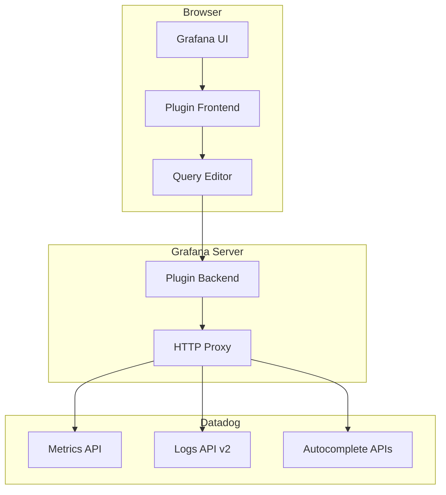
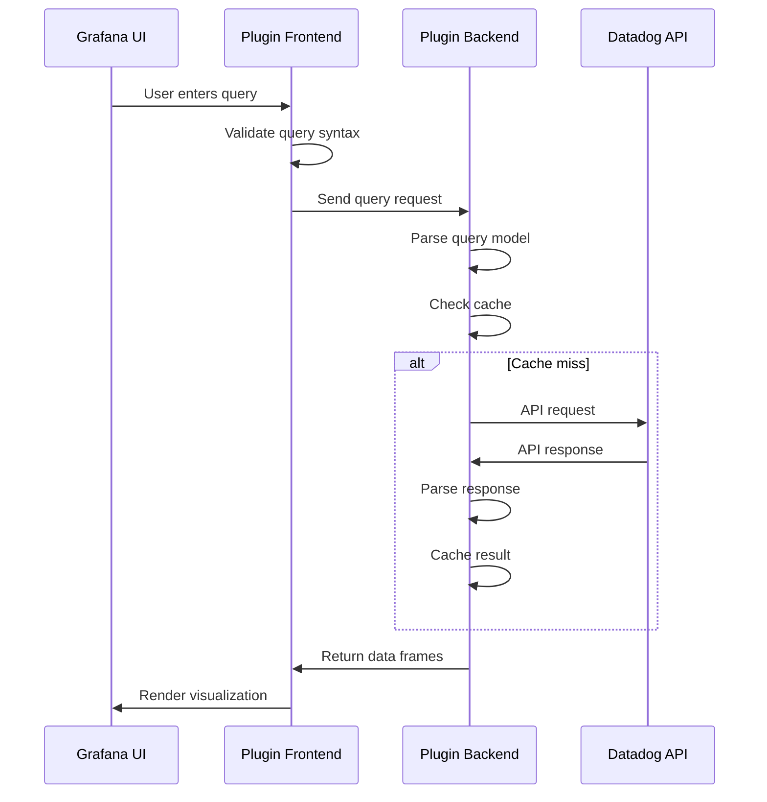
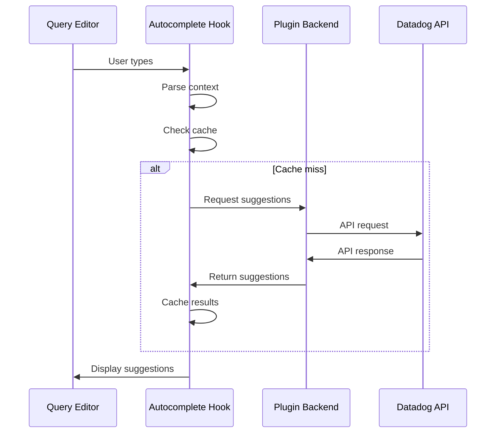
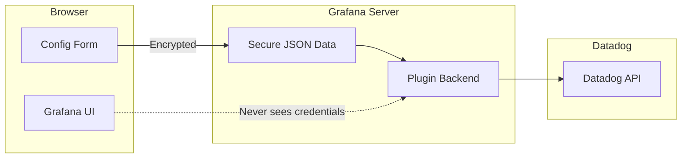
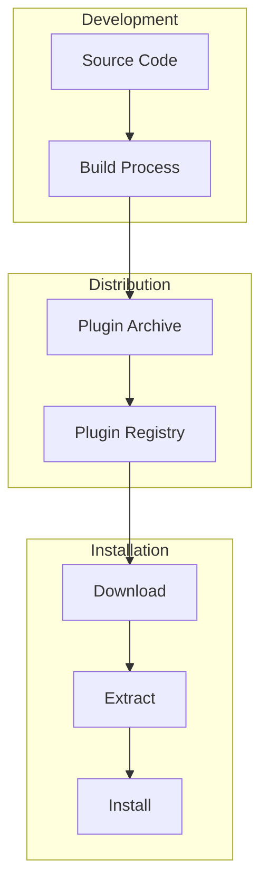

# Plugin Architecture

This document describes the architecture and design patterns of the Grafana Datadog datasource plugin.

## Overview

The plugin follows Grafana's standard datasource architecture with a React/TypeScript frontend and Go backend, providing secure communication with Datadog's APIs.



## Frontend Architecture

### Component Structure

```
src/
├── components/
│   ├── QueryEditor.tsx          # Main query editor component
│   ├── LogsQueryEditor.tsx      # Logs-specific query editor
│   ├── ConfigEditor.tsx         # Datasource configuration
│   └── VariableQueryEditor.tsx  # Variable query editor
├── hooks/
│   └── useQueryAutocomplete.ts  # Autocomplete logic hook
├── utils/
│   ├── autocomplete/            # Autocomplete system
│   ├── variableInterpolation.ts # Variable handling
│   └── queryValidator.ts        # Query validation
├── types.ts                     # TypeScript definitions
├── datasource.ts               # Main datasource class
└── module.ts                   # Plugin entry point
```

### Key Components

#### DataSource Class (`datasource.ts`)

The main datasource class that implements Grafana's `DataSourceApi`:

```typescript
export class DataSource extends DataSourceApi<MyQuery, MyDataSourceOptions> {
  // Query execution
  query(request: DataQueryRequest<MyQuery>): Observable<DataQueryResponse>
  
  // Health check
  testDatasource(): Promise<TestDataSourceResponse>
  
  // Variable queries
  metricFindQuery(query: VariableQuery): Promise<MetricFindValue[]>
  
  // Supplementary queries (logs volume)
  getSupplementaryQuery(type: SupplementaryQueryType, query: MyQuery): MyQuery
}
```

#### Query Editor (`QueryEditor.tsx`)

Handles both metrics and logs query editing:

```typescript
interface QueryEditorProps {
  query: MyQuery;
  onChange: (query: MyQuery) => void;
  onRunQuery: () => void;
  datasource: DataSource;
}
```

Features:
- Query type detection (metrics vs logs)
- Syntax highlighting with Monaco Editor
- Real-time autocomplete
- Query validation
- Formula support

#### Autocomplete System (`hooks/useQueryAutocomplete.ts`)

Provides intelligent autocomplete suggestions:

```typescript
export function useQueryAutocomplete({
  datasource,
  queryType,
  onSuggestionSelected
}: UseQueryAutocompleteProps) {
  // Fetches suggestions based on context
  // Caches results for performance
  // Handles both metrics and logs contexts
}
```

### State Management

The plugin uses React hooks for state management:

- **Local state**: Component-specific state with `useState`
- **Shared state**: Context providers for datasource configuration
- **Caching**: Custom hooks for API response caching
- **Debouncing**: Input debouncing for autocomplete performance

### Type System

Comprehensive TypeScript types ensure type safety:

```typescript
// Main query interface
interface MyQuery extends DataQuery {
  queryType?: 'logs' | 'metrics';
  query?: string;        // Metrics query
  logQuery?: string;     // Logs query
  expression?: string;   // Formula expression
  legendFormat?: string; // Custom legend
}

// Autocomplete context types
interface QueryContext {
  contextType: ContextType;
  currentToken: string;
  cursorPosition: number;
  nearestFacet?: string;
}
```

## Backend Architecture

### Package Structure

```
pkg/plugin/
├── datasource.go              # Main datasource implementation
├── query_handler.go           # Query routing and dispatch
├── logs.go                    # Logs query implementation
├── logs_handler.go            # Logs-specific handler
├── logs_response_parser.go    # Logs response parsing
├── datadog_logs_request_builder.go    # Logs API requests
├── datadog_metrics_request_builder.go # Metrics API requests
└── *_test.go                  # Unit tests
```

### Core Components

#### Datasource (`datasource.go`)

Main plugin entry point implementing Grafana's backend interfaces:

```go
type Datasource struct {
    // Configuration
    JSONData       map[string]interface{}
    SecureJSONData map[string]string
    
    // Caching
    cache          map[string]*CacheEntry
    logsCache      map[string]*LogsCacheEntry
    
    // Concurrency control
    cacheMu        sync.Mutex
    logsCacheMu    sync.Mutex
}

// Main interfaces
func (d *Datasource) QueryData(ctx context.Context, req *backend.QueryDataRequest) (*backend.QueryDataResponse, error)
func (d *Datasource) CheckHealth(ctx context.Context, req *backend.CheckHealthRequest) (*backend.CheckHealthResult, error)
func (d *Datasource) CallResource(ctx context.Context, req *backend.CallResourceRequest, sender backend.CallResourceResponseSender) error
```

#### Query Handler (`query_handler.go`)

Routes queries to appropriate handlers based on query type:

```go
type QueryHandler interface {
    HandleQuery(ctx context.Context, req *backend.QueryDataRequest) (*backend.QueryDataResponse, error)
}

type QueryType string

const (
    MetricsQueryType QueryType = "metrics"
    LogsQueryType    QueryType = "logs"
)
```

#### Logs Implementation (`logs.go`)

Handles Datadog Logs API v2 integration:

```go
// Main logs query function
func (d *Datasource) queryLogs(ctx context.Context, req *backend.QueryDataRequest) (*backend.QueryDataResponse, error)

// Pagination support
func (d *Datasource) executeSingleLogsPageQuery(ctx context.Context, logsQuery string, from, to int64, cursor string, pageSize int) ([]LogEntry, string, error)

// Response parsing
func (d *Datasource) parseDatadogLogsResponse(apiResponse interface{}) ([]LogEntry, error)
```

### API Request Builders

Abstracted API request construction for maintainability:

#### Logs Request Builder (`datadog_logs_request_builder.go`)

```go
type DatadogLogsRequestBuilder struct {
    apiKey  string
    appKey  string
    baseURL string
}

func (b *DatadogLogsRequestBuilder) BuildLogsSearchRequest(ctx context.Context, params LogsSearchRequestParams) (*http.Request, error)
func (b *DatadogLogsRequestBuilder) BuildLogsAggregationRequest(ctx context.Context, params LogsAggregationRequestParams) (*http.Request, error)
```

### Response Parsing

Dedicated parsers for different API responses:

#### Logs Response Parser (`logs_response_parser.go`)

```go
type LogsResponseParser struct {
    datasource *Datasource
}

func (p *LogsResponseParser) ParseResponse(apiResponse interface{}, refID string, query string) (data.Frames, error)
func (p *LogsResponseParser) createLogsDataFrames(logEntries []LogEntry, refID string, query string) data.Frames
func (p *LogsResponseParser) createLogsVolumeFrame(logEntries []LogEntry, refID string, timeRange backend.TimeRange) *data.Frame
```

### Caching Strategy

Multi-level caching for performance:

```go
// Metrics cache
type CacheEntry struct {
    Data      []byte
    Timestamp time.Time
}

// Logs cache
type LogsCacheEntry struct {
    LogEntries []LogEntry
    NextCursor string
    Timestamp  time.Time
}

// Autocomplete cache
type LogsAutocompleteCacheEntry struct {
    Data      []string
    Timestamp time.Time
}
```

Cache TTL:
- **Metrics**: 30 seconds
- **Logs**: 10 seconds (more dynamic)
- **Autocomplete**: 30 seconds
- **Variables**: 5 minutes

## Data Flow

### Query Execution Flow



### Autocomplete Flow



## Security Architecture

### Credential Handling



Security features:
- **No frontend credentials**: API keys never sent to browser
- **Encrypted storage**: Grafana encrypts sensitive data
- **Backend-only API calls**: All Datadog communication via backend
- **Request validation**: Input sanitization and validation

### Authentication Flow

1. **Configuration**: User enters API/App keys in Grafana UI
2. **Encryption**: Grafana encrypts and stores keys securely
3. **Backend access**: Plugin backend retrieves decrypted keys
4. **API authentication**: Backend adds authentication headers
5. **Proxy requests**: All API calls proxied through Grafana

## Performance Optimizations

### Frontend Optimizations

1. **Debounced input**: Autocomplete requests debounced to 300ms
2. **Request deduplication**: Identical requests are deduplicated
3. **Component memoization**: React.memo for expensive components
4. **Lazy loading**: Code splitting for large components

### Backend Optimizations

1. **Connection pooling**: HTTP client with connection reuse
2. **Request caching**: Multi-level caching with TTL
3. **Concurrent limiting**: Max 5 concurrent requests per datasource
4. **Context cancellation**: Proper request cancellation
5. **Memory management**: Efficient data structures and cleanup

### Caching Strategy

```go
// Cache key generation
func (d *Datasource) generateCacheKey(query string, from, to int64, params ...string) string {
    return fmt.Sprintf("%s:%d:%d:%s", query, from, to, strings.Join(params, ":"))
}

// TTL-based expiration
func (d *Datasource) isExpired(timestamp time.Time, ttl time.Duration) bool {
    return time.Since(timestamp) > ttl
}
```

## Error Handling

### Frontend Error Handling

```typescript
// Query error handling
try {
  const response = await datasource.query(request);
  return response;
} catch (error) {
  console.error('Query failed:', error);
  return {
    data: [],
    error: {
      message: 'Query execution failed',
      refId: query.refId
    }
  };
}
```

### Backend Error Handling

```go
// Structured error responses
func (d *Datasource) handleQueryError(err error, refID string) backend.DataResponse {
    logger.Error("Query failed", "error", err, "refID", refID)
    
    return backend.ErrDataResponse(
        backend.StatusBadRequest,
        fmt.Sprintf("Query error: %s", d.parseDatadogError(err))
    )
}

// Error parsing and user-friendly messages
func (d *Datasource) parseDatadogError(err error) string {
    // Convert API errors to user-friendly messages
    // Handle authentication, permission, and syntax errors
    // Provide actionable suggestions
}
```

## Testing Architecture

### Frontend Testing

- **Unit tests**: Jest + React Testing Library
- **Component tests**: Isolated component testing
- **Hook tests**: Custom hook testing
- **Integration tests**: Full query flow testing

### Backend Testing

- **Unit tests**: Go standard testing
- **Property-based tests**: For complex logic validation
- **Integration tests**: API communication testing
- **Mock testing**: Datadog API mocking

### Test Structure

```
tests/
├── components/           # React component tests
├── hooks/               # Hook tests
├── utils/               # Utility function tests
└── integration/         # End-to-end tests

pkg/plugin/
├── *_test.go           # Go unit tests
├── testdata/           # Test fixtures
└── mocks/              # Mock implementations
```

## Deployment Architecture

### Plugin Distribution



### Build Process

1. **Frontend build**: TypeScript → JavaScript bundle
2. **Backend build**: Go → Platform-specific binaries
3. **Asset bundling**: Combine frontend and backend
4. **Archive creation**: Create distribution archive
5. **Signing**: Sign plugin for security (optional)

## Monitoring and Observability

### Logging Strategy

```go
// Structured logging
logger.Info("Query executed",
    "refID", refID,
    "queryType", queryType,
    "duration", duration,
    "cacheHit", cacheHit,
)

logger.Error("API request failed",
    "error", err,
    "endpoint", endpoint,
    "statusCode", statusCode,
)
```

### Metrics Collection

- **Query performance**: Execution time tracking
- **Cache efficiency**: Hit/miss ratios
- **Error rates**: API and query error tracking
- **Resource usage**: Memory and CPU monitoring

### Health Checks

```go
func (d *Datasource) CheckHealth(ctx context.Context, req *backend.CheckHealthRequest) (*backend.CheckHealthResult, error) {
    // Test API connectivity
    // Verify credentials
    // Check autocomplete endpoints
    // Return detailed status
}
```

## Future Architecture Considerations

### Scalability

- **Horizontal scaling**: Multiple Grafana instances
- **Load balancing**: Distribute API requests
- **Rate limiting**: Respect Datadog API limits
- **Circuit breakers**: Handle API failures gracefully

### Extensibility

- **Plugin system**: Support for custom extensions
- **Hook system**: Allow custom query transformations
- **Theme support**: Custom visualization themes
- **Export formats**: Additional data export options

### Performance

- **Streaming**: Real-time data streaming
- **Compression**: Response compression
- **CDN**: Asset delivery optimization
- **Edge caching**: Geographically distributed caching